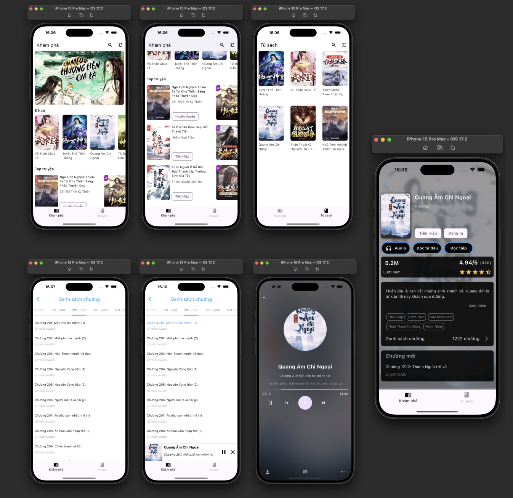

# audiobook

A mobile application for reading and listening to stories offline.

## Overview

This application allows users to read stories and listen to audio versions while offline on their devices. With a user-friendly interface, users can enjoy their favorite stories anywhere, anytime.

## Features

- **Offline Audio**: Listen to stories without the need for an internet connection.
- **Easy Navigation**: Browse through a collection of stories effortlessly.
- **User-Friendly Interface**: Intuitive design for an enhanced reading experience.

## Demo Image

## Getting Started

This project is a starting point for a Flutter application.

A few resources to get you started if this is your first Flutter project:

- [Lab: Write your first Flutter app](https://docs.flutter.dev/get-started/codelab)
- [Cookbook: Useful Flutter samples](https://docs.flutter.dev/cookbook)

For help getting started with Flutter development, view the [online documentation](https://docs.flutter.dev/), which offers tutorials, samples, guidance on mobile development, and a full API reference.
